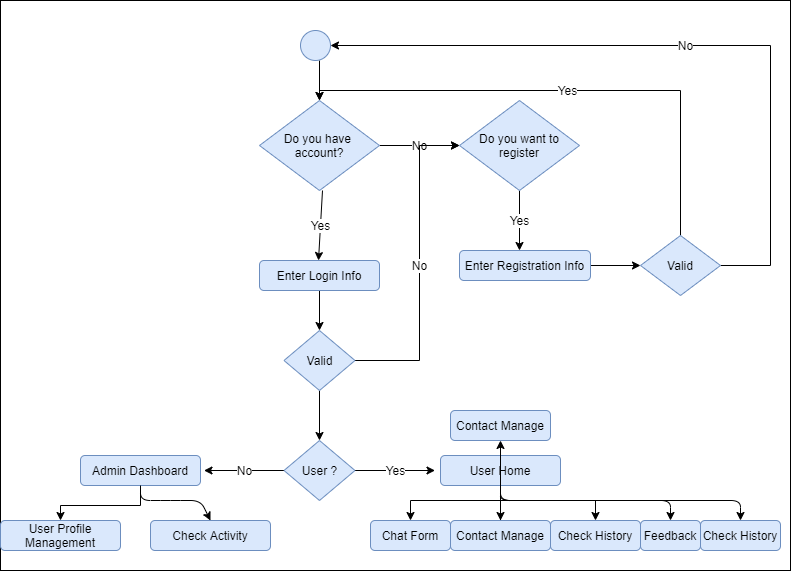
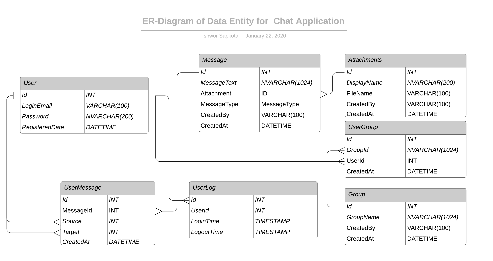

# System Architecture for Chat Application 
## Introduction
Its an architecture document for a chat application with some constraints of using C# ASP.NET Web API and any one of javascript framework to be used. Although it has no technical choices to be made for languages we can have a choice of accessing some inbuilt libraries of those languages for making our application better. 
### Document Overview
This document describes the architecture of Chat Application system.
It describes:
- A general description of system and requirements
- The logical architecture of software, the layers and top-level components
- The physical architecture of the hardware on which runs the software
- The justification of technical choices made
- The traceability between the architecture and the system requirements.
## Functional and Non Functional Requirements
### Functional Requirements
1. User Registration
    - User must be able to register for the application through a valid email or phone. 
    - Auto register must be available for gmail.

2. Adding New Contacts
    - User must be able to add contacts using registered email or phone and send request to the user.

3. Send Message 
    - User should be able to send instant message to any person in contact list. 
    - User should be notified when message is successfully delivered to the recipient.

4. Broadcast Message 
    - User should be able to create groups of contacts. 
    - User should be able to broadcast messages to these groups.

5. Message Status 
    - User must be able to get information on whether the message sent has been read by the intended recipient.
    - User must be notified for any new message broadcast or send personally on application title.

### Non Functional Requirements
1. Privacy 
    - Messages shared between users should be encrypted to maintain privacy.
    - Only encrypted message need to be stored on database so as to maintain privacy. 

2. Robustness 
    - DataServer must have specific backup schedule so as to recover the history on any kind of system crash. 

3. Performance 
    - Application must send messages instantly.

## Use Case Table

### Use Case Description
#### Authentication 
Both type of user admin and normal has to be authenticated through the system. Normal user has to register with his/her email address or phone number and need to be verified before logging in to the system
- Register
- Login
- Logout

[Note: Specific Use Case Diagram can be displayed if necessary]
#### Manage Friends
Authenticated user can add, block or remove friends, create group of friends for chat and manage them. 
- Friend List
- Find friend
- Add Friend
- Create group
- Remove Friend
- Block Friend

[Note: Specific Use Case Diagram can be displayed if necessary]
#### Chat
Authenticated user can send or receive message from another user. Notification will be displayed for message delivery, message received and new message arrival. Live chat must be possible without any delay.
- Send
- Receive
- Broadcast

[Note: Specific Use Case Diagram can be displayed if necessary.]
#### Manage and Monitor
Normal user can view chat history and search message on the history. Admin can manage the profile and block or remove the user on misconduct or misuse of the application and manage the feedback.
- Manage Profile
- View History
- Feedback

[Note: Specific Use Case Diagram can be displayed if necessary]
### Activity Diagram
Activity diagram below shows an user workflow of the application starting from authentication to different activity.

[Note: Other diagram specific to different activity in the application can be displayed and explained if necessary]
## 1.2 Architecture
### 1.2.1 Architecture Overview
It’s a basic chat application where any mobile or desktop user can resister and start chatting with another registered user. User can chat with each other whenever he/she is add to his friend circle. The chat can be live if the user is online otherwise the message is shown whenever the user gets online. There will be two or more user involved in the system. One is the source of message and second one is target which can be multiple.

### 1.2.2 Physical Architecture Overview
Describe the hardware components on which software runs and their interactions/relationships.

### 1.2.3 Logical Architecture Overview
Describe the top level software components and their interactions/relationships.
Use UML package diagrams and/or layer diagrams and/or interface diagrams.
Describe also the operating systems on which the software runs.
#### 1.2.3.1 API Server

#### 1.2.3.2 Chat Server
#### 1.2.3.3 Chat Client

### Deployment Architecture

